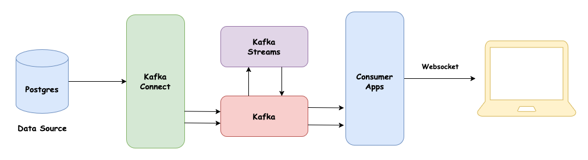

# Qontak Room Stream Analytic

## Architecture



## Topology

```text
(Source: qontak_chat.public.rooms)
    │
    ▼
[RoomCDC Stream]
    │
    ▼
[Extract Timestamp: RoomCreatedAt]  -- Assigns event time from RoomCreatedAt
    │
    ▼
[Filter: Retain only last 90 days]  -- Discards older events
    │
    ▼
[Map: Transform RoomCDC → RoomStatusEvent]  -- Converts raw CDC data into a structured RoomStatusEvent
    │
    ▼
(Store: room-status-events as KTable)  -- Stores latest RoomStatusEvent per room
    │
    ▼
(Changelog Source: room-streams-analytic-dev-room-status-events-changelog)
    │
    ▼
[RoomStatusEvent Stream]  -- Reads latest room statuses
    │
    ▼
[Process: Detect RoomStatus Changes]  -- Identifies changes in room status
    │
    ▼
[FlatMap: Generate RoomStatusChange Events]  -- Emits change events when status updates
    │
    ▼
[Group By: (Org ID, Room Status)]  -- Groups by organization and status
    │
    ▼
[Windowed Aggregate: Count in 90-day window]  -- Aggregates status changes within a 90-day window
    │
    ▼
[Filter: Only Active Windows]  -- Ensures only recent windows are processed
    │
    ▼
[Map: Format as RoomStatusCount]  -- Converts aggregated results to a structured output
    │
    ▼
(Sink: room-status-count)  -- Writes to final topic

```